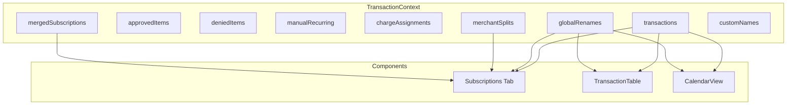
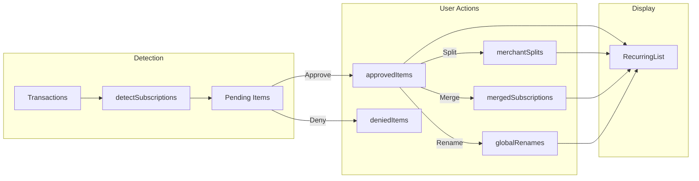

# FinTrack Codebase Architecture

> **Purpose:** Reference document for understanding state flows and dependencies before making changes.  
> **Last Updated:** December 2024

---

## Quick Reference: High-Risk Areas

> [!CAUTION]
> **Recurring Features (splits/merges/renames)** - Changes here cascade to CalendarView, TransactionTable, and search.
>
> **Name Resolution Chain** - Multiple components depend on this. Test thoroughly after any changes.

---

## State Architecture

### Central State: TransactionContext

All persistent state flows through [TransactionContext.jsx](file:///Users/lukas/Desktop/antigravity%20projects/transaction%20analysis/src/context/TransactionContext.jsx).



---

## localStorage Keys

| Key | Type | Purpose | Consumers |
|-----|------|---------|-----------|
| `fintrack_transactions` | Array | All imported transactions | TransactionContext, dashboard |
| `fintrack_recurring_approved` | Array | Approved subscription merchant keys | Subscriptions, Calendar |
| `fintrack_recurring_denied` | Array | Denied subscription merchant keys | Subscriptions |
| `fintrack_manual_recurring` | Array | Manually added recurring items | Subscriptions |
| `fintrack_charge_assignments` | Object | Transaction → recurring item mapping | TransactionRow |
| `fintrack_merchant_splits` | Object | Split subscription configs | Subscriptions, RecurringItem |
| `fintrack_merged_subscriptions` | Object | Merged subscription groupings | Subscriptions, RecurringItem |
| `fintrack_global_renames` | Object | Merchant rename overrides | **6 files** (see below) |
| `fintrack_recurring_names` | Object | Custom display names for recurring | RecurringItem |
| `fintrack_recurring_categories` | Object | Category overrides | RecurringItem |
| `fintrack_subscription_emails` | Object | Subscription → email associations | RecurringItem |
| `fintrack_shared_subscriptions` | Array | Shared subscription configs | Subscriptions |
| `fintrack_person_names` | Object | Person display names | People |
| `fintrack_people_list` | Array | List of all people | People, TransactionRow |
| `fintrack_person_settlements` | Object | Settlement tracking | People |

---

## Critical Dependency: Name Resolution

**The "Effective Name" system** determines what merchant name displays to the user. This is HIGH RISK because 6 components rely on it.

### Resolution Priority (highest → lowest):

```javascript
// From TransactionRow.jsx and RecurringItem.jsx
globalRenames[merchantKey]?.displayName  // 1. Global rename
  || sub.displayName                      // 2. Subscription display name
  || customNames[merchantKey]             // 3. Custom name
  || sub.merchant                         // 4. Original merchant
```

### Files that consume globalRenames:

| File | How it uses globalRenames |
|------|---------------------------|
| [TransactionRow.jsx](file:///Users/lukas/Desktop/antigravity%20projects/transaction%20analysis/src/features/transactions/components/TransactionRow.jsx) | Displays renamed merchant in table |
| [RecurringItem.jsx](file:///Users/lukas/Desktop/antigravity%20projects/transaction%20analysis/src/features/recurring/components/RecurringItem.jsx) | Shows renamed subscription name |
| [CalendarView.jsx](file:///Users/lukas/Desktop/antigravity%20projects/transaction%20analysis/src/components/CalendarView.jsx) | Matches renewals to renamed merchants |
| [TransactionTable.jsx](file:///Users/lukas/Desktop/antigravity%20projects/transaction%20analysis/src/components/TransactionTable.jsx) | Passes to TransactionRow |
| [Subscriptions.jsx](file:///Users/lukas/Desktop/antigravity%20projects/transaction%20analysis/src/components/Subscriptions.jsx) | Provides setter to children |
| [TransactionContext.jsx](file:///Users/lukas/Desktop/antigravity%20projects/transaction%20analysis/src/context/TransactionContext.jsx) | Source of truth |

### The chargeAssignment Override

In TransactionRow, `chargeAssignment` can override the default merchantKey lookup:

```javascript
const merchantKey = chargeAssignment || getMerchantKey(txn.description);
```

This means **split charges** can have their own rename distinct from the parent merchant.

---

## Recurring Feature Architecture

### Data Flow



### Key Functions

| Function | Location | Purpose |
|----------|----------|---------|
| `detectSubscriptions()` | [recurringUtils.js](file:///Users/lukas/Desktop/antigravity%20projects/transaction%20analysis/src/features/recurring/utils/recurringUtils.js) | Groups transactions into recurring patterns |
| `getMerchantKey()` | [categorize.js](file:///Users/lukas/Desktop/antigravity%20projects/transaction%20analysis/src/utils/categorize.js) | Normalizes merchant to 8-char key |
| `amountsMatch()` | recurringUtils.js | Fuzzy amount matching (±3%) |

---

## Component Hierarchy

```
App.jsx
├── TransactionProvider (context)
│   ├── Dashboard
│   │   ├── KPICards
│   │   ├── SpendingChart
│   │   └── CategoryDonut
│   ├── TransactionTable
│   │   └── TransactionRow (uses globalRenames)
│   ├── Subscriptions
│   │   ├── RecurringStats
│   │   ├── PendingReviewList
│   │   └── RecurringList
│   │       └── RecurringItem (uses globalRenames, splits, merges)
│   ├── CalendarView (uses globalRenames)
│   ├── People
│   └── Alerts
```

---

## Known Gotchas

1. **Search uses effective names** — TransactionTable search should match against display names, not just raw merchant. If search breaks after rename changes, check this.

2. **Split items have compound keys** — Format: `merchantKey-amount` (e.g., `APPLE.CO-10.99`). These keys are used in globalRenames.

3. **Merge hides source items** — When items are merged, the source merchantKeys are stored in `mergedSubscriptions[targetKey]`. They still exist in transactions but shouldn't display separately.

4. **Calendar renewals match by key** — CalendarView looks up renewals using merchantKey. If a rename doesn't include the right key, calendar won't show the correct name.

---

## Before Modifying Shared Code

1. **Check this document** for dependencies
2. **Run:** `grep -r "functionName" src/` to find all usages
3. **List what might break** in your change summary
4. **Run tests after changes:** `npm run test`
