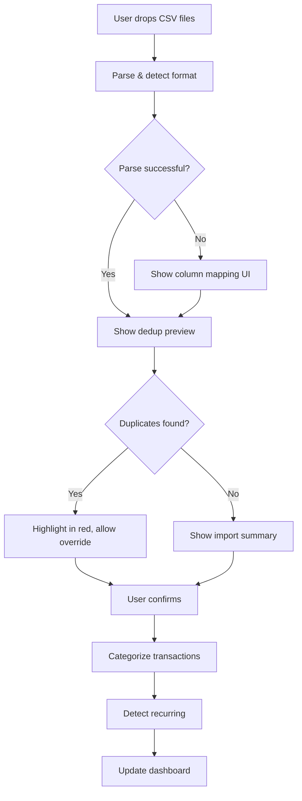
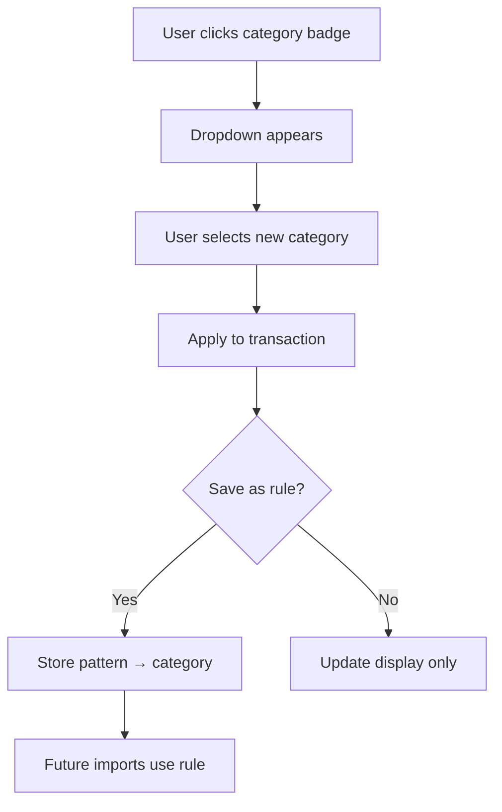
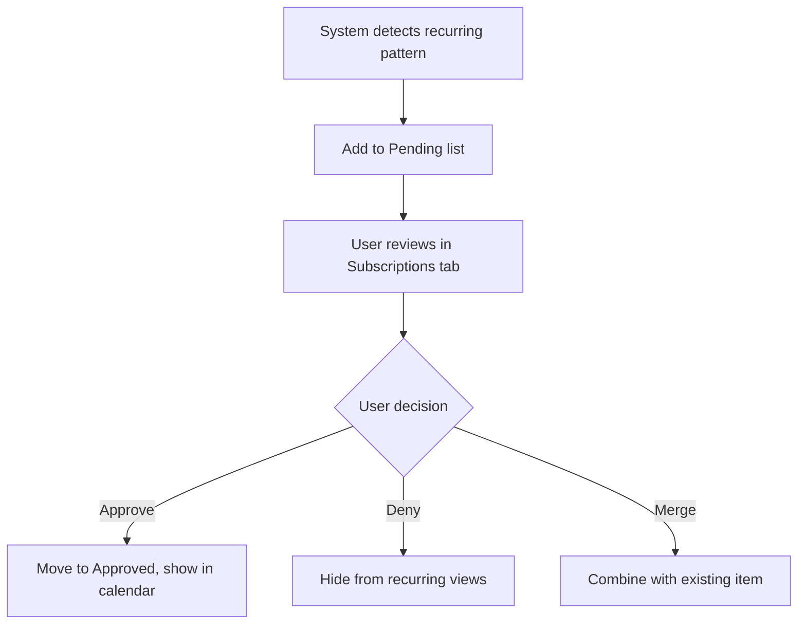

# FinTrack Dashboard – Product Requirements Document (PRD)

> **Version:** 1.0  
> **Last Updated:** December 2024  
> **Status:** Implementation Complete

---

## Executive Summary

FinTrack Dashboard is a **privacy-first personal finance management application** that enables users to upload bank transaction data from CSV exports, automatically categorize spending, detect recurring subscriptions, track shared expenses with people, and visualize financial trends—**entirely offline with no server-side data storage**.

### Target User
Personal finance enthusiasts who want full control of their financial data without trusting third-party aggregators (Mint, YNAB, etc.) with bank credentials.

### Core Value Proposition
- **100% Privacy**: All data stays in browser localStorage—zero transmission to any server
- **Multi-Bank Support**: Works with CSV exports from major banks (TD, Chase, Amex, Apple Card, Capital One)
- **Intelligent Automation**: Auto-categorization + recurring payment detection with user override capability
- **Split Tracking**: Manage shared expenses and subscriptions with roommates/family

---

## Functional Requirements

### FR-1: Data Import & Management

#### FR-1.1: CSV File Upload
| Requirement | Details |
|------------|---------|
| **Input Methods** | Drag-and-drop zone, file picker, or paste CSV content directly |
| **Multi-file Upload** | Support simultaneous upload of multiple CSV files |
| **Account Type Detection** | Auto-detect Chequing vs Credit Card based on filename patterns or content analysis |
| **Supported Formats** | Standard bank CSV exports with flexible column detection |

#### FR-1.2: Multi-Format CSV Parsing
The system shall detect and parse various CSV column structures:

| Bank Format | Date Column | Description Column | Amount Handling |
|------------|-------------|-------------------|-----------------|
| TD Bank | `Date` | `Description` or `Merchant` | Separate `Debit`/`Credit` columns |
| Chase Bank | `Transaction Date` | `Description` | Single `Amount` (negative = debit) |
| American Express | `Date` | `Description` | Single `Amount` |
| Apple Card | Date variants | Merchant name | Amount with +/- |
| Generic | Auto-detect | Auto-detect | Auto-detect |

**Preview Capability**: Before full import, show first 10 rows with detected column mappings for user verification.

#### FR-1.3: Duplicate Detection & Prevention
| Requirement | Details |
|------------|---------|
| **Hash Generation** | Create unique hash from: `date + description + amount` |
| **Cross-Session Dedup** | Compare new imports against previously stored transactions |
| **Within-File Handling** | First occurrence imported, exact duplicates (same row repeated) silently skipped |
| **Preview Modal** | Show duplicates in red diff-style before confirming import |
| **Override Option** | Allow user to force-import specific flagged duplicates |

#### FR-1.4: Data Persistence
| Requirement | Details |
|------------|---------|
| **Storage Method** | Browser `localStorage` |
| **Data Clearing** | One-click "Clear All Data" with confirmation |
| **Export** | Download all transactions as CSV |
| **No Server** | Zero network requests, no user accounts |

---

### FR-2: Transaction Categorization

#### FR-2.1: Automatic Categorization Engine
The system shall categorize transactions using a rule-based matching system:

**Category Taxonomy:**
| Category | Description | Example Merchants |
|----------|-------------|-------------------|
| `ENTERTAINMENT` | Streaming, games, media | Netflix, Spotify, PlayStation |
| `DINING` | Restaurants, food delivery | McDonald's, Uber Eats, Starbucks |
| `GROCERIES` | Supermarkets, food stores | Walmart, Costco, Metro |
| `SHOPPING` | General retail, e-commerce | Amazon, Best Buy, IKEA |
| `UTILITIES` | Bills, internet, phone | Starlink, Bell, Hydro |
| `TRANSPORTATION` | Rides, transit, fuel | Uber, Lyft, Shell |
| `GAMBLING` | Betting, casinos | TheScore, DraftKings |
| `FEES` | Bank charges, service fees | Service Charge, NSF Fee |
| `INCOME` | Deposits, refunds | Payroll, E-TRANSFER RECEIVED |
| `TRANSFER` | E-transfers sent/received | INTERAC E-TRANSFER |
| `OTHER` | Unmatched transactions | — |

**Matching Logic:**
1. Check user-defined rules first (pattern → category mapping)
2. Fall back to 50+ built-in merchant patterns
3. Default to `OTHER` if no match

#### FR-2.2: User-Configurable Category Rules
| Requirement | Details |
|------------|---------|
| **In-Transaction Edit** | Click category badge in any transaction row to reassign |
| **Rule Learning** | When category changed, offer to save as rule for description pattern |
| **Rule Persistence** | Store custom rules in localStorage, applied on future imports |
| **Rule Management** | Ability to view and delete custom categorization rules |

---

### FR-3: Recurring Payment Detection

#### FR-3.1: Subscription Detection Algorithm
The system shall automatically identify recurring payments using:

| Criterion | Threshold |
|-----------|-----------|
| Minimum Occurrences | 4+ transactions from same merchant |
| Interval Tolerance | ±5 days from expected period |
| Amount Tolerance | ±20% of average to handle price changes |
| Excluded Categories | `DINING`, `GROCERIES`, `SHOPPING`, `TRANSPORTATION` |

**Supported Frequencies:** Weekly, Bi-weekly, Monthly, Quarterly, Annual

#### FR-3.2: Approval Workflow
| State | Description |
|-------|-------------|
| **Pending** | Newly detected, awaiting user review |
| **Approved** | Confirmed subscription, shown in active list |
| **Denied** | Not a subscription, hidden from recurring view |

#### FR-3.3: Subscription Details View
For each recurring item, display:
- Merchant name (user-editable/renameable)
- Monthly equivalent cost
- Payment frequency detected
- Total spent historically
- All individual charges (expandable timeline)
- Price change indicators
- Next projected payment date

#### FR-3.4: Email Association
| Requirement | Details |
|------------|---------|
| **Per-Subscription Email** | Associate email account used for subscription login |
| **Dropdown Selector** | Quick-pick from previously used emails |
| **New Email Entry** | Add new email addresses inline |
| **Display** | Show email badge in collapsed subscription row |

#### FR-3.5: Merchant Merge & Split
| Feature | Description |
|---------|-------------|
| **Merge** | Combine multiple detected items that are actually same subscription |
| **Split** | Separate incorrectly grouped transactions into distinct subscriptions |
| **Global Rename** | Rename merchant display name across all views |

---

### FR-4: Shared Subscriptions & Expense Splitting

#### FR-4.1: Shared Subscription Tracking
| Requirement | Details |
|------------|---------|
| **Share With People** | Assign 1+ people to any subscription |
| **Split Ratio** | Define percentage or equal split |
| **Cost Per Person** | Calculate each person's share of monthly cost |
| **Visual Breakdown** | Show pie chart of who pays what |

#### FR-4.2: Charge-Level Splitting
| Requirement | Details |
|------------|---------|
| **Individual Charges** | Assign specific charges to specific people |
| **Create New Items** | Split single subscription into multiple tracked items |
| **Running Totals** | Show what each person has been charged over time |

---

### FR-5: People Management & Balance Tracking

#### FR-5.1: People Registry
| Requirement | Details |
|------------|---------|
| **Add People** | Create named contacts for expense tracking |
| **Auto-Detection** | Suggest names from e-transfer descriptions |
| **Persist Names** | Store in localStorage with recent-used ordering |

#### FR-5.2: Transaction Assignment
| Requirement | Details |
|------------|---------|
| **Quick Assign** | One-click assign any transaction to a person |
| **Bulk Support** | Assign multiple transactions at once |
| **Person Filter** | View all transactions assigned to specific person |

#### FR-5.3: Balance Summary
| Requirement | Details |
|------------|---------|
| **Net Balance** | Calculate what each person owes/is owed |
| **Incoming/Outgoing** | Track money sent vs received |
| **Settlement Status** | Mark debts as settled |
| **Expandable Detail** | Click person to see all their transactions |

---

### FR-6: Dashboard & Visualization

#### FR-6.1: KPI Summary Cards
Display at-a-glance metrics:

| KPI | Calculation |
|-----|-------------|
| Net Flow | Total credits − Total debits |
| Total Income | Sum of all credits |
| Total Expenses | Sum of all debits |
| Savings Rate | (Income − Expenses) / Income × 100% |

#### FR-6.2: Spending Bar Chart
| Requirement | Details |
|------------|---------|
| **X-Axis** | Months |
| **Y-Axis** | Amount in dollars |
| **Bars** | Stacked or grouped showing Income (green) vs Expenses (red) |
| **Interactivity** | Hover for tooltips with exact values |

#### FR-6.3: Category Donut Chart
| Requirement | Details |
|------------|---------|
| **Segments** | Top 8 spending categories by total |
| **Center Label** | Total spending amount |
| **Legend** | 2-column grid below chart with color, label, percentage |
| **Colors** | Distinct per-category color palette |

#### FR-6.4: Top Merchants List
| Requirement | Details |
|------------|---------|
| **Display** | Top 5-10 merchants by total spent |
| **Info** | Merchant name, transaction count, total amount |

#### FR-6.5: Date Range Filtering
| Preset | Description |
|--------|-------------|
| All Time | No date filter |
| This Month | Current calendar month |
| Last 3 Months | Rolling 90-day period |
| Last 6 Months | Rolling 180-day period |
| This Year | Current calendar year |
| Custom Range | User-selected start/end dates |

---

### FR-7: Transaction Table View

#### FR-7.1: Table Display
| Column | Description |
|--------|-------------|
| Date | Transaction date, sortable |
| Merchant | Normalized merchant name |
| Category | Badge with category (clickable to edit) |
| Amount | Debit (red) or Credit (green) |
| Account | Chequing or Credit Card with icon |
| Person | Assigned person badge (if any) |
| Actions | Person assignment, recurring flag |

#### FR-7.2: Filtering & Sorting
| Filter Type | Options |
|------------|---------|
| Category | Dropdown of all active categories |
| Account Type | All / Chequing / Credit Card |
| Transaction Type | All / Spending / Income |
| Date Range | Same presets as dashboard |
| Search | Text search in description |

| Sort Field | Direction |
|------------|-----------|
| Date | Asc / Desc (default: newest first) |
| Amount | Asc / Desc |

#### FR-7.3: Pagination
| Requirement | Details |
|------------|---------|
| **Default Display** | 50 transactions |
| **Load More** | Button to load next 50 |
| **Show All** | Option to display all transactions |
| **Count Display** | "Showing X of Y transactions" |

#### FR-7.4: Summary Footer
| Metric | Description |
|--------|-------------|
| Total Amount | Sum of filtered transactions |
| Transaction Count | Number of filtered transactions |
| Net (if mixed) | Credits − Debits |

---

### FR-8: Calendar View

#### FR-8.1: Monthly Calendar Grid
| Requirement | Details |
|------------|---------|
| **Grid Layout** | 7-column week grid, standard calendar layout |
| **Navigation** | Previous/Next month arrows, Today button |
| **Day Cells** | Show colored dots for transactions |
| **Dot Colors** | Category-based coloring |

#### FR-8.2: Day Detail Panel
| Requirement | Details |
|------------|---------|
| **Click Behavior** | Click day to open side panel |
| **Panel Content** | List all transactions for that day |
| **Per-Transaction** | Merchant, amount (green credit/red debit), category badge, person |
| **Day Total** | Sum of spending and income for day |

#### FR-8.3: Projected Renewals
| Requirement | Details |
|------------|---------|
| **Future Dates** | Show expected subscription renewal markers |
| **Visual Distinction** | Different marker style for projected vs actual |
| **Time Constraint** | Only show projections for today and future (not past) |

---

### FR-9: Alerts System

#### FR-9.1: Spending Alerts
The system shall generate alerts for:

| Alert Type | Trigger | Severity |
|------------|---------|----------|
| High Gambling | Gambling spend > $500/month | Danger |
| High Fees | Bank fees > $50/month | Warning |
| Large Transaction | Single transaction > $500 | Info |
| Category Surge | Category spend 50%+ above average | Warning |

#### FR-9.2: Alert Display
| Requirement | Details |
|------------|---------|
| **Dedicated Tab** | Alerts view in sidebar navigation |
| **Card Style** | Color-coded severity (red/amber/blue) |
| **Actionable** | Link to relevant transactions or category |

---

## Non-Functional Requirements

### NFR-1: Privacy & Security
| Requirement | Details |
|------------|---------|
| **Data Location** | 100% client-side (browser localStorage) |
| **Network Activity** | Zero external API calls for user data |
| **No Tracking** | No analytics, telemetry, or third-party scripts |

### NFR-2: Performance
| Requirement | Target |
|------------|--------|
| **Initial Load** | < 2 seconds on 4G connection |
| **CSV Parse Time** | < 1 second for 1,000 transactions |
| **UI Responsiveness** | < 100ms for filter/sort operations |
| **Memory** | Handle 10,000+ transactions without lag |

### NFR-3: Browser Support
| Browser | Minimum Version |
|---------|-----------------|
| Chrome | 90+ |
| Firefox | 88+ |
| Safari | 14+ |
| Edge | 90+ |

### NFR-4: Responsive Design
| Requirement | Details |
|------------|---------|
| **Desktop** | Optimized for 1280px+ width |
| **Tablet** | Functional at 768px+ |
| **Mobile** | Basic support (not primary target) |

---

## Technical Architecture

### Technology Stack

| Layer | Technology | Version |
|-------|-----------|---------|
| UI Framework | React | 19.x |
| Build Tool | Vite | 7.x |
| Charts | Chart.js + react-chartjs-2 | 4.x / 5.x |
| CSV Parsing | PapaParse | 5.x |
| Icons | Lucide React | 0.5x |
| Testing | Vitest + React Testing Library | 4.x |

### Project Structure
```
dashboard/
├── src/
│   ├── components/          # UI components
│   │   ├── FileUpload.jsx   # CSV import with preview
│   │   ├── KPICards.jsx     # Summary statistics
│   │   ├── SpendingChart.jsx # Monthly bar chart
│   │   ├── CategoryDonut.jsx # Category breakdown
│   │   ├── TransactionTable.jsx # Filterable grid
│   │   ├── Subscriptions.jsx # Recurring tracker
│   │   ├── CalendarView.jsx # Calendar spending view
│   │   ├── People.jsx       # Person assignment
│   │   ├── Alerts.jsx       # Spending alerts
│   │   ├── DateRangeFilter.jsx
│   │   ├── TopMerchants.jsx
│   │   ├── Toast.jsx        # Notifications
│   │   ├── SplitMerchantModal.jsx
│   │   └── SplitChargesModal.jsx
│   ├── features/            # Feature modules
│   │   ├── calendar/
│   │   ├── people/
│   │   ├── recurring/
│   │   ├── split-charges/
│   │   └── transactions/
│   ├── utils/               # Business logic
│   │   ├── parseCSV.js      # Multi-format CSV parser
│   │   ├── categorize.js    # Categorization engine
│   │   ├── stats.js         # Calculations
│   │   ├── transactionId.js # Hash generation
│   │   └── constants.js
│   ├── context/
│   │   └── TransactionContext.jsx
│   ├── App.jsx
│   ├── App.css
│   └── index.css            # Design system
├── public/
├── package.json
└── vite.config.js
```

### Data Model

#### Transaction Object
```javascript
{
  id: string,           // Unique hash
  date: Date,           // Transaction date
  description: string,  // Raw bank description
  merchant: string,     // Normalized merchant name
  category: string,     // Category classification
  debit: number,        // Amount spent (0 if credit)
  credit: number,       // Amount received (0 if debit)
  source: string,       // Original filename
  accountType: string   // "chequing" | "credit"
}
```

#### LocalStorage Keys
| Key | Purpose |
|-----|---------|
| `fintrack_transactions` | All imported transactions |
| `fintrack_recurring_approved` | Approved subscription merchant keys |
| `fintrack_recurring_denied` | Denied subscription merchant keys |
| `fintrack_recurring_pending` | Pending subscription merchant keys |
| `fintrack_category_rules` | User-defined categorization rules |
| `fintrack_people` | People registry |
| `fintrack_person_assignments` | Transaction → Person mappings |
| `fintrack_subscription_emails` | Subscription → Email associations |
| `fintrack_merchant_splits` | Split subscription configurations |
| `fintrack_merged_subscriptions` | Merged subscription groupings |
| `fintrack_global_renames` | Merchant rename overrides |

---

## Design System

### Color Palette
```css
--bg-primary: #0f0f1a      /* Deep navy background */
--bg-secondary: #1a1a2e    /* Card backgrounds */
--bg-card: rgba(30, 30, 50, 0.7)   /* Glassmorphism cards */
--text-primary: #ffffff
--text-secondary: #a0a0b0
--accent-primary: #6366f1   /* Indigo */
--accent-secondary: #8b5cf6 /* Purple */
--accent-success: #10b981   /* Green */
--accent-warning: #f59e0b   /* Amber */
--accent-danger: #ef4444    /* Red */
```

### Typography
- **Font Family**: Inter, -apple-system, BlinkMacSystemFont, system-ui
- **Sizes**: 0.75rem (xs) → 2rem (display)

### Component Patterns
- **Cards**: Glassmorphism with backdrop blur, subtle border
- **Buttons**: Gradient backgrounds with hover elevation
- **Badges**: Pill-shaped with category-specific colors
- **Tables**: Minimal borders, hover highlighting
- **Modals**: Centered overlay with dark backdrop

---

## User Flows

### Flow 1: First-Time Import


### Flow 2: Category Override


### Flow 3: Subscription Approval


---

## Future Considerations

### Potential Enhancements (Not in Current Scope)
1. **AI-Assisted Categorization**: LLM integration for unknown merchants
2. **Budget Goals**: Set monthly targets per category
3. **PDF Statement Import**: Parse bank PDFs via OCR
4. **Cloud Sync (Optional)**: Encrypted backup to user's own storage
5. **Mobile App**: React Native version for iOS/Android
6. **Multi-Currency**: Support for transactions in different currencies
7. **Investment Tracking**: Portfolio integration

---

## Glossary

| Term | Definition |
|------|------------|
| **Merchant Key** | Normalized first 8 characters of merchant name for fuzzy matching |
| **Recurring Item** | Transaction pattern occurring 4+ times at regular intervals |
| **Split** | Sharing a subscription cost among multiple people |
| **Merge** | Combining multiple detected recurring items into one |
| **Global Rename** | Overriding merchant display name across all views |

---

## Appendix: Supported Bank Formats

### TD Bank (Canada)
```csv
Date,Description,Debit,Credit,Balance
12/01/2024,INTERAC PURCHASE - AMAZON.CA,49.99,,1234.56
```

### Chase Bank (US)
```csv
Transaction Date,Post Date,Description,Category,Type,Amount
12/01/2024,12/02/2024,NETFLIX.COM,Entertainment,Sale,-15.99
```

### American Express
```csv
Date,Description,Amount
12/01/2024,UBER *TRIP,-23.50
```

### Apple Card
```csv
Transaction Date,Clearing Date,Description,Merchant,Category,Amount (USD)
12/01/2024,12/02/2024,App Store,Apple,Entertainment,-4.99
```

---

*This PRD represents the complete feature set of FinTrack Dashboard as implemented. For implementation details, refer to the codebase documentation and inline comments.*
