# FinTrack Development Chronicle
> *A visual timeline of how a simple question became a full-fledged financial dashboard*

---

## The Origin Story

```mermaid
graph LR
    A["💬 'How many subscriptions<br/>do I have?'"] --> B["📊 Python Analyzer"]
    B --> C["📈 'Can we do more?'"]
    C --> D["🚀 React Dashboard"]
    
    style A fill:#4f46e5,stroke:#312e81,color:#fff
    style D fill:#10b981,stroke:#065f46,color:#fff
```



What started as a simple curiosity—**"I need to go through this financial information. How many subscriptions do I have?"**—evolved into a comprehensive personal finance dashboard spanning thousands of lines of code across dozens of components.

---

## Phase 1: The Python Era
### *"Just tell me about my subscriptions"*

````carousel

<!-- slide -->

```mermaid
flowchart TD
    subgraph "Day 1: Analysis Scripts"
        CSV["📄 accountactivity.csv<br/>(Bank Export)"]
        SA["🐍 subscription_analyzer.py"]
        TA["🐍 transaction_analyzer.py"]
        CSV --> SA
        CSV --> TA
        SA --> SR["📋 Subscription Report"]
        TA --> TR["📋 Transaction Report"]
    end
```

### Initial Capabilities
| Feature | Status |
|---------|--------|
| Parse TD Bank CSV | ✅ |
| Detect recurring payments | ✅ |
| Categorize spending | ✅ |
| Generate markdown reports | ✅ |
<!-- slide -->
### Early Insights Generated
- 15 recurring subscriptions detected
- **$2,335** on gambling (97 transactions) flagged
- **$343** in cash advance fees identified  
- **$544** in bank fees over 18 months
- Running at **-$400/month** average
````

> [!NOTE]
> The Python scripts were a proof of concept. They worked, but required re-running commands and had no interactivity.

---

## Phase 2: The Dashboard Emerges
### *"I want a financial management dashboard for handling my financial transactions going forward"*


### The Initial Feature Request → Component Mapping


---

## Phase 3: Iteration & Polish
### *"What can we improve? Make what we have airtight and robust"*

This phase introduced dozens of refinements through rapid iteration:

````carousel
### Issue: CSV Preview Needed
```diff
- Upload → Silent parsing → Hope it worked
+ Upload → Preview first 10 rows → Confirm mapping → Import
```
<!-- slide -->
### Issue: Account Type Detection
```diff
- All transactions looked the same
+ Chequing: 🏦 green icon
+ Credit Card: 💳 orange icon
```
<!-- slide -->
### Issue: 100 Transaction Limit
```diff
- const display = transactions.slice(0, 100);
+ Pagination with "Load More" & "Show All"
+ "Showing 47 of 1,523 transactions"
```
````

---

## Phase 4: Advanced Features
### *Building the subscription detection engine*

```mermaid
flowchart TD
    subgraph "Subscription Detection Algorithm"
        T["All Transactions"] --> G["Group by Merchant<br/>(fuzzy matching)"]
        G --> F["Filter: 4+ occurrences"]
        F --> I["Check interval consistency<br/>(±5 days tolerance)"]
        I --> A["Check amount consistency<br/>(±20% tolerance)"]
        A --> E{"Excluded Category?"}
        E -->|DINING, GROCERIES,<br/>SHOPPING, TRANSPORT| X["❌ Not a Subscription"]
        E -->|Other| S["✅ Detected Subscription"]
    end
    
    style S fill:#10b981,stroke:#065f46,color:#fff
    style X fill:#ef4444,stroke:#7f1d1d,color:#fff
```



### 🐛 Problem: Pizza & Starbucks as "Subscriptions"

> [!WARNING]
> The algorithm was too aggressive. Weekly coffee runs were showing as subscriptions!

**The Fix:**
1. Bumped minimum occurrences from 2 → 4
2. Excluded `DINING` and `GROCERIES` categories
3. Required stricter interval consistency

---

## Phase 5: Calendar View
### *"A cool calendar view where I could see all transactions but especially for subscriptions"*

```mermaid
flowchart LR
    subgraph CalendarView.jsx
        M["Month Navigation<br/>← Nov 2024 →"]
        G["7-Column Grid"]
        D["Day Cells with<br/>Category-Colored Dots"]
        P["Side Panel:<br/>Click for Details"]
        PR["🔄 Projected Renewals<br/>(Future Only)"]
    end
    
    M --> G --> D --> P
    D --> PR
```



### 🐛 Problem: Projected Subscriptions in the Past


> The projection logic showed renewals on past dates like Nov 19, even though that had already passed.

**The Fix:** Added check `if (projectedDate >= today)` before rendering projections.

---

## Phase 6: People & E-Transfers
### *"I send and receive e-transfers all the time. These are to people—mostly family members"*


### Feature Evolution

| Version | Capability |
|---------|------------|
| v1 | E-transfer tab showing TRANSFER category only |
| v2 | Renamed to "People" tab, any transaction assignable |
| v3 | Balance tracking: who owes what |
| v4 | Pre-defined people list (add before assigning) |
| v5 | Recent people bubble to top of dropdowns |
| v6 | Unified people list across all tabs |

---

## Phase 7: User-Defined Categories
### *"The only solution I can think of is a way for me to manually change categories"*


### The Animation Problem

> [!IMPORTANT]
> We wanted items to slide out when their category changed (while filtering). But the recategorization happened instantly, removing items before the animation could play.

**Solution:** Keep exiting items in view during animation:

```javascript
// Include exiting items regardless of category match
if (exitingIds.has(t.id)) return true;
return categoryFilter === 'all' || t.category === categoryFilter;
```

---

## Phase 8: The Great JSX Structural Collapse
### *When Subscriptions.jsx broke... repeatedly*

This phase was a debugging saga. The Subscriptions component kept breaking due to unbalanced JSX tags.


### The Diagnosis Tools

```bash
# Count opening vs closing div tags
echo "Opens:"; grep -c "<div" Subscriptions.jsx
echo "Closes:"; grep -c "</div>" Subscriptions.jsx
# Result: Opens: 42, Closes: 41 — AH HA!
```

### The Python Fix

When traditional edits failed, Python saved the day:

```python
# Fix the indentation at specific line numbers
lines[654] = '                    </div>\n'  # 20 spaces
lines[655] = '                ))}\n'          # 16 spaces  
lines[656] = '            </div>\n'          # 12 spaces
lines[657] = '        </div>\n'              # 8 spaces
lines[658] = '    );\n'                      # 4 spaces
```

> [!CAUTION]
> This happened multiple times! Each feature addition to Subscriptions.jsx risked breaking the component's structure.

---

## Phase 9: Shared Subscriptions
### *"How to represent shared subscriptions in the subscriptions tab"*


**Key Design Decision:** Keep these systems separate!
- Transaction assignment = **Accounting** (who paid for what)
- Subscription sharing = **Informational** (who conceptually shares costs)

---

## The Architecture Today


---

## Lessons Learned

### 1. Start Simple, Iterate Fast
The Python scripts validated the core concept before investing in a full React app.

### 2. Edge Cases Hide in Plain Sight
- Starbucks as a "subscription" 
- Projected renewals in the past
- Duplicate detection on fresh imports

### 3. State Management Gets Complex
What started as simple transaction list grew to require:
- Category rules persistence
- People lists synced across components
- Real-time recategorization
- Animation coordination with state changes

### 4. JSX Structure is Fragile
Deeply nested components (like Subscriptions.jsx at 660+ lines) become hard to maintain. Future refactoring should split into smaller components.

### 5. Python is a Great Escape Hatch
When traditional edits fail, a Python script with explicit line numbers can surgically fix issues.

---

## Feature Timeline Overview


---

## Current State & Future Vision

### What Works Today ✅

| Feature | Description |
|---------|-------------|
| Multi-bank CSV import | TD, Chase, Amex, Apple Card support |
| Smart categorization | 50+ patterns + user rules |
| Subscription detection | 4+ occurrence algorithm |
| Calendar view | Past transactions + future projections |
| People tracking | Balances, assignments, unified list |
| Animations | Category change slide-out effects |
| Toast notifications | Real-time feedback |

### What's Next 🔮

| Feature | Status |
|---------|--------|
| Rename "Subscriptions" → "Recurring" | Planned |
| Group recurring by category | Planned |
| Manual removal from recurring tab | Planned |
| Multi-user support | Far future |
| Budget goals per category | Future |
| PDF statement import | Future |

---

*This chronicle was generated from the development conversation history, capturing the organic evolution of FinTrack from a simple Python script to a comprehensive personal finance dashboard.*

